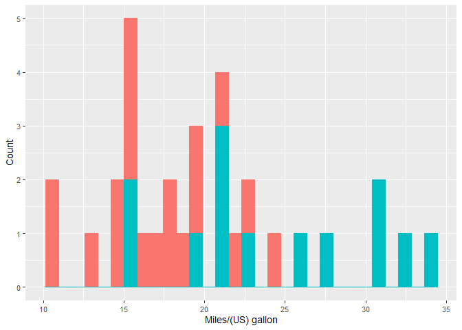

<!-- README.md is generated from README.Rmd. Please edit that file -->

# pRedictwine

<!-- badges: start -->

[](https://codecov.io/gh/DSCI-310-2024/pRedictwine)
[](https://github.com/DSCI-310-2024/pRedictwine/actions/workflows/R-CMD-check.yaml)
<!-- badges: end -->

The goal of pRedictwine is to aid in the workflow of a linear regression
analysis. It provides functions that could aid in the steps of loading
and tidying the data, histograms for exploratory analysis, and creating
the linear regression model.

Contains 3 functions that are aimed to help in the workflow of a linear
regression analysis. Such functions are one to load an online dataset
and change the columns’ names, another to create appropriate histograms,
and a last one to directly create the linear regression model. This
package was created mainly for the prediction of wine quality through
MLR, found in
<https://github.com/DSCI-310-2024/dsci-310_group-7_wine-quality-prediction>.

This package is meant to be used for the programming language R. The
version of R used to create this project was 4.3.2. Where pRedictwine
sits in the package ecosystem for R is in a bundle along with other
packages that aid in loading and wrangling data (readr and tidyverse),
creating histograms (ggplot2), and creating a fitted linear regression
model (parsnip and recipes). However, our package differs from the
aforementioned ones as our functions allow the user to reach their
desired end product without having to use multiple functions. Instead,
specifying with a single function does the trick (more details on this
in Usage).

## Installation

You can install the development version of pRedictwine from
[GitHub](https://github.com/DSCI-310-2024/pRedictwine) with:

``` r
# install.packages("pRedictwine")
devtools::install_github("DSCI-310-2024/pRedictwine")
```

## Usage

1.  Loading a dataset from an URL and changing its column names: When
    you want to load an online dataset from an URL and at the same time
    change the names of the columns, usually you have to first load the
    data and then subsequently change the column names. However, with
    pRedictwine, you can do it all with a single function with
    load_W_new_col().

``` r
library(pRedictwine)

dataset_url <- "https://raw.githubusercontent.com/plotly/datasets/master/mtcars.csv"

new_col_names <- c("model", "milespergallon", "cylinder_number", "displacement", "horsepower", "rear_axle_ratio", "weight", "quartermiletime", "engine", "transmission", "forwardgears", "carb")

comma_delimiter <- ","

loaded_dataset <- load_w_new_col(dataset_url, new_col_names, comma_delimiter)
#> Rows: 32 Columns: 12
#> ── Column specification ────────────────────────────────────────────────────────
#> Delimiter: ","
#> chr  (1): manufacturer
#> dbl (11): mpg, cyl, disp, hp, drat, wt, qsec, vs, am, gear, carb
#> 
#> ℹ Use `spec()` to retrieve the full column specification for this data.
#> ℹ Specify the column types or set `show_col_types = FALSE` to quiet this message.

head(loaded_dataset)
#> # A tibble: 6 × 12
#>   model   milespergallon cylinder_number displacement horsepower rear_axle_ratio
#>   <chr>            <dbl>           <dbl>        <dbl>      <dbl>           <dbl>
#> 1 Mazda …           21                 6          160        110            3.9 
#> 2 Mazda …           21                 6          160        110            3.9 
#> 3 Datsun…           22.8               4          108         93            3.85
#> 4 Hornet…           21.4               6          258        110            3.08
#> 5 Hornet…           18.7               8          360        175            3.15
#> 6 Valiant           18.1               6          225        105            2.76
#> # ℹ 6 more variables: weight <dbl>, quartermiletime <dbl>, engine <dbl>,
#> #   transmission <dbl>, forwardgears <dbl>, carb <dbl>
```

2.  Create a histogram: If you want to create a histogram with x labels,
    different coloured values by group, and specifiable x-axis, y-axis,
    labels; you can do so with create_histogram(). Usually, with
    ggplot2, multiple layers have to be specified but with
    create_histogram(), it is possible to do so in a single function.

``` r
library(pRedictwine)

mpghistogram <- create_histogram(df = mtcars_mutated, x = mpg, group = am,
                  x_lab = "Miles/(US) gallon", y_lab = "Count", font_size = 10.5)

mpghistogram
#> `stat_bin()` using `bins = 30`. Pick better value with `binwidth`.
```



3.  Create a model: When creating fitted linear models, quite a few
    functions have to be used and in the correct order. This could be
    confusing. If you want to create a fitted linear regression model in
    a single step, you can do so with fit_linear_reg().

``` r
library(pRedictwine)

mpg_fit <- fit_linear_reg(mpg ~ ., mtcars)


mpg_fit
#> ══ Workflow [trained] ══════════════════════════════════════════════════════════
#> Preprocessor: Recipe
#> Model: linear_reg()
#> 
#> ── Preprocessor ────────────────────────────────────────────────────────────────
#> 0 Recipe Steps
#> 
#> ── Model ───────────────────────────────────────────────────────────────────────
#> 
#> Call:
#> stats::lm(formula = ..y ~ ., data = data)
#> 
#> Coefficients:
#> (Intercept)          cyl         disp           hp         drat           wt  
#>    12.30337     -0.11144      0.01334     -0.02148      0.78711     -3.71530  
#>        qsec           vs           am         gear         carb  
#>     0.82104      0.31776      2.52023      0.65541     -0.19942
```
